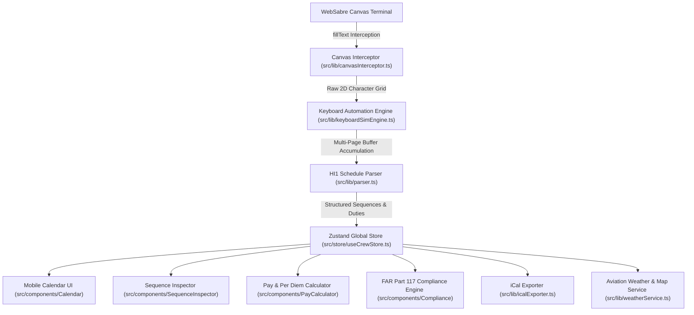

# ✈️ CrewSchedule Pro — System Architecture & Technical Documentation
**Author**: Chief Software Architect / Lead Systems Engineer  
**Date**: August 5, 2026  
**Version**: 1.0.0 (Production Core Release)  
**Target Environment**: Desktop / Mobile Cell Phone View (Strictly Optimized for Mobile Viewports)

---

## 📑 Executive Summary

**CrewSchedule Pro** is an enterprise-grade mobile-first web application designed specifically for airline pilots and flight attendants. It automates the extraction, parsing, visualization, and management of flight crew monthly schedules (specifically American Airlines DECS / WebSabre `HI1` schedules). 

The platform bridges legacy mainframe terminal screens (SABRE/DECS) with a state-of-the-art modern mobile UI featuring interactive monthly calendars, leg-by-leg sequence inspectors, pay calculators, FAA FAR Part 117 compliance checkers, live aviation weather maps (METAR, TAF, AIRMET/SIGMET, Turbulence, Lightning), and iCal calendar exports.

---

## 🏛️ 1. Overall System Architecture

---

## 🖥️ 2. WebSabre / DECS Canvas Scraping Subsystem

Because WebSabre terminal screens render text onto an HTML5 `<canvas>` element instead of standard DOM elements, standard web scrapers cannot extract text via standard DOM queries. CrewSchedule Pro implements a custom low-level Canvas interception engine.

### Key Components:

1. **`src/lib/canvasInterceptor.ts`**:
   - **`CanvasRenderingContext2D.prototype.fillText` Interception**: Overrides HTML5 Canvas text rendering methods to intercept raw text strings, exact $(X, Y)$ coordinate points, font styles, and text colors prior to canvas rasterization.
   - **Dynamic Y-Clustering**: Groups intercepted draw calls into discrete terminal lines by clustering $Y$-coordinates within a $\pm 5\text{px}$ threshold.
   - **Column Alignment & Character Preservation**: Calculates character width from canvas metrics (`measureText("M")`) and maps $(X, Y)$ coordinates to exact 2D grid columns.
   - **Space Overwriting Protection**: Features strict character protection during matrix assembly—preventing space characters from adjacent draw calls from overwriting existing letters/digits.

2. **`src/lib/keyboardSimEngine.ts`**:
   - **Automated Macro Execution**: Dispatches keyboard commands (`HI1`, `MD`, `PB`) directly into the WebSabre input focus.
   - **Multi-Page Pagination**: Automatically detects `END F DISPLY` or `‡ENDOF SCROL‡`, issuing scroll commands (`MD`) until the entire schedule sequence is captured into the buffer.

---

## 🧩 3. HI1 Schedule Parser Engine (`src/lib/parser.ts`)

The parser converts raw DECS terminal lines into structured TypeScript object hierarchies (`SequenceTrip`, `DutyPeriod`, `FlightLeg`).

### Key Algorithmic Innovations:

1. **Month-Boundary Anchor Engine (`constructDateStr`)**:
   - Analyzes sequence dates and `monthEnding` headers to automatically resolve year/month roll over (e.g. December 31 to January 1).

2. **Multi-Line Day Handling**:
   - Accommodates heavy flight days where a single calendar day spans multiple terminal rows. It maintains state across continuation rows to ensure zero flights or days are omitted.

3. **DECS Layover Airport Expander Map (`normalizeAirportCode`)**:
   - DECS terminal output often clips 3-letter IATA airport codes down to 2 letters (e.g. `FA`, `RI`, `SP`). The parser routes layover matches through an expander dictionary:
     - `FA` → `FAR` (Fargo)
     - `RI` → `RIC` (Richmond)
     - `SP` → `SPI` (Springfield)
     - `CM` → `CMI` (Champaign)
     - `CL` → `CLE` (Cleveland)
     - `FS` → `FSM` (Fort Smith)
     - `MA` → `MAF` (Midland)
     - `ML` → `MLI` (Moline)
     - `GS` → `GSO` (Greensboro)

4. **Cumulative Sequence Credit Extraction**:
   - DECS HI1 lines display daily credit and cumulative sequence credit side-by-side (e.g. `6.25 22.29`). In canvas memory, these can mash together as `6.2522.29`.
   - The parser inspects lines preceding `EP TAFB` summary markers using a dual-pattern strategy:
     - **Mashed Double-Decimals**: Matches `/(\d{1,2}\.\d{2})(\d{1,2}\.\d{2})/` and extracts the 2nd decimal group as Total Sequence Credit (`22.29`, `16.26`).
     - **Spaced Decimals**: Extracts the rightmost decimal number on the terminal line.

5. **Vacation & Off-Day Block Extractor**:
   - Detects `VC` (Vacation), `SK` (Sick), `DHO` (Drop Duty), `RO` (Reserve Off), and `OF` (Days Off) entries, properly demarcating rest periods from flight duty periods.

---

## 💾 4. Global State & Persistence (`src/store/useCrewStore.ts`)

Built on **Zustand** with persistent storage middleware (`crew-schedule-storage` key in `localStorage`).

### Managed State:
- **`currentSchedule`**: Active list of imported sequences, vacation blocks, and off-days.
- **`revisionHistory`**: Historical schedule imports with side-by-side diff tracking.
- **`userSettings`**: Crew base (e.g. DFW, ORD, MIA), seat (CA, FO, FA), default calendar view, notification preferences.
- **`activeSequence`**: Currently selected sequence for leg-by-leg inspection.

---

## 🌤️ 5. Weather & Aviation Map Subsystem (`src/lib/weatherService.ts`, `src/app/api/`)

Provides real-time situational awareness for flight crews.

### Features:
- **Live METAR / TAF**: Fetches current weather reports and terminal aerodrome forecasts for origin, destination, and layover airports.
- **AIRMET / SIGMET Proxy**: Server-side proxy fetching active icing, turbulence, convective, and IFR weather advisories from Aviation Weather Center (AWC).
- **Interactive Weather Maps**:
  - Lightning strike overlay
  - IFR low-altitude enroute navigation charts
  - Turbulence heatmaps

---

## 📱 6. User Interface Architecture (Mobile-First Design)

In compliance with project design directives, the UI is strictly optimized for **Mobile / Cell Phone Viewports**.

| Component Module | File Location | Functional Purpose |
| :--- | :--- | :--- |
| **Mobile Calendar** | `src/components/Calendar/` | Compact monthly grid view with sequence color badges, day-off highlights, and bottom-sheet drawers for day details. |
| **Sequence Inspector** | `src/components/SequenceInspector/` | Deep inspection of flight legs, departure/arrival times (UTC & Local), flight numbers, equipment types, and layover durations. |
| **Pay Calculator** | `src/components/PayCalculator/` | Computes block pay vs credit pay, monthly guarantee breakdown, per diem calculations based on TAFB hours. |
| **FAR 117 Compliance** | `src/components/Compliance/` | Automated validation against FAA Part 117 flight time limits, daily duty limits, and mandatory rest periods. |
| **Flight Briefing** | `src/components/Briefing/` | Pre-flight weather briefing summary, METAR/TAF reader, and route advisories. |
| **Macro Action Bar** | `src/components/MacroActionBar.tsx` | Quick touch-friendly controls for executing WebSabre macros directly from the mobile UI. |
| **iCal Exporter** | `src/lib/icalExporter.ts` | Generates RFC 5545 compliant `.ics` calendar files for seamless sync with iOS Calendar and Google Calendar. |

---

## 🛠️ 7. Development Status & Roadmap Notes

### 🟢 Completed & Fully Verified (Production Ready)
- [x] Multi-page DECS `HI1` automated terminal scraper with canvas interception.
- [x] Space-overwriting protection in canvas character matrix assembly.
- [x] Multi-line day flight aggregator for high-density sequence days.
- [x] Expander map for 2-letter DECS airport codes (`FA`→`FAR`, `RI`→`RIC`, etc.).
- [x] Dual-pattern credit extractor for both spaced (`6.25 22.29`) and canvas-mashed (`6.2522.29`) total sequence pay credits.
- [x] Mobile cell phone viewport UI with bottom sheet drawers and touch-optimized navigation.
- [x] iCal `.ics` schedule exporter.
- [x] Offline local storage persistence without external cloud dependencies.

### 🟡 In Active Development (Phase 2 Roadmap)
- [ ] **Live Flight Status Tracking**: Integrating real-time flight telemetry (FlightAware / FlightStats API) to track incoming aircraft delays.
- [ ] **Automated FAA Logbook Exporter**: One-tap export of completed sequence flight hours into digital pilot logbooks (LogTen Pro, ForeFlight).
- [ ] **FAR 117 Cumulative Fatigue Risk Alerting**: Visual warning indicators for 100-hours-in-28-days or 1000-hours-in-365-days rolling limits.
- [ ] **Offline PWA In-Flight Mode**: Service worker caching to enable full schedule and sequence viewing while in airplane mode.

---

## 📌 Summary for Developers & Maintainers
CrewSchedule Pro operates strictly on local execution. All schedule parsing, canvas scraping, state storage, and calendar generation occur directly inside the user's environment. Maintainers updating the parser should consult `src/lib/parser.ts` and test changes against `decs_debug.log` prior to releasing builds.
